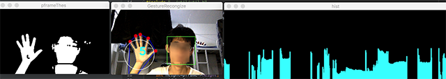

#Robust Hand Gesture Recongization Demo

###需要的依赖[Dependencies]:
+ Opencv

#####基本思路[Idea]：
读入图像(RGB)->Haar分类器检测人脸->转换到YCrCb颜色空间->提取Cb通道分量->Otsu 阈值检测肤色->找到轮廓->通过Haar分类器检测到的人脸排除人脸轮廓->约束轮廓条件(轮廓大小、轮廓面积和最小包围矩形之比)->找到手部轮廓->找到手的轮廓重心(二阶矩)->计算轮廓重心到轮廓边缘的极坐标直方图->对直方图进行高斯卷积以平滑和削弱小的极值峰->对直方图求导(水平差分)或使用数值分析方法找到峰值点->找到候选指尖点->排除离图像下边较近的点->找到指尖->计算直方图均值半径R->计算R为半径的跳变点数目->计算指尖数目->画出指尖。

###演示效果[Demo]

###编译方式[Compile]
+ 使用JetBrain Clion 打开。 
+ 也可以使用Cmake构建。

###作者[Anthor]
+ Jack Yu 庾金科 C语言课程设计。
+ 金融软件 工程 1 班 